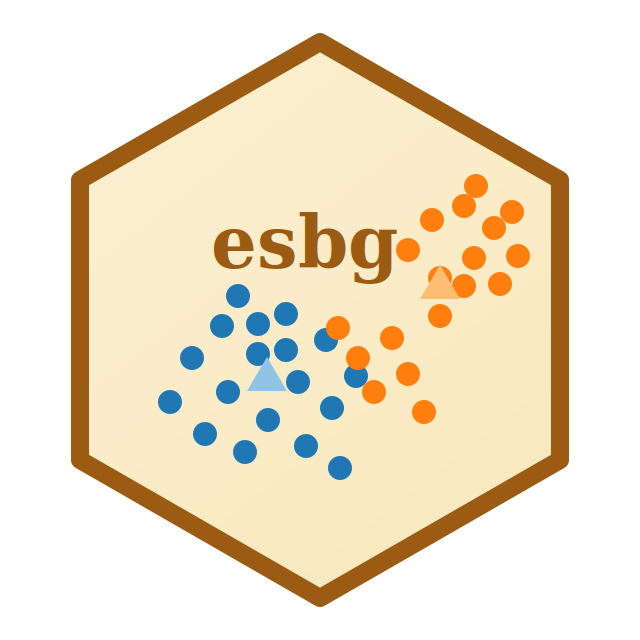
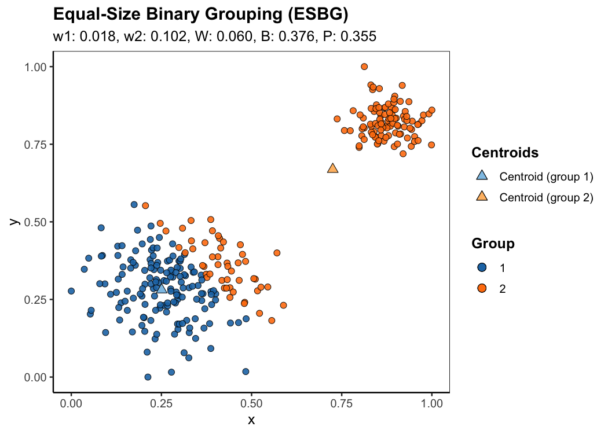

# esbg: Equal-Size Binary Grouping for Polarization Measurement




[](https://github.com/Tang-SIMSOC/esbg)
[](https://lifecycle.r-lib.org/articles/stages.html#experimental)
[](https://opensource.org/licenses/MIT)

**Equal-Size Binary Grouping (ESBG)** is a novel approach for measuring (bi-)polarization without predefined, exogenous group structures. It searches for a partition of data into two equal-sized groups and then measures polarization by assessing how compact each group is and how far apart the two groups are. A key advantage of ESBG is its intuitive structure: polarization decreases with within-group heterogeneity and increases with between-group heterogeneity. This aligns with the fundamental idea in the literature that the notion of group -- where members of the same (different) group should be similar (dissimilar) -- is key to conceptualizing polarization.

ESBG was proposed by Tang et al. (2022) in the paper [*Together Alone: A Group-Based Polarization Measurement*](https://link.springer.com/article/10.1007/s11135-021-01271-y), published in *Quality & Quantity*, and has been used to measure polarization in various disciplines, especially in opinion dynamics.

This repository provides `esbg`, an R package for applying ESBG in R. The package helps users search for an estimated partition, compute within-group and between-group heterogeneities, measure polarization, and visualize the resulting group structure.

## Installation

`esbg` requires R 3.6.0 or later. The default EM method does not require any clustering package beyond `esbg`'s regular dependencies. The optional centroid-based method (`cluster_method = "centroid"`) requires the suggested package [`anticlust`](https://cran.r-project.org/package=anticlust).

`esbg` is currently intended for installation from GitHub:

```r
install.packages("remotes")
remotes::install_github("Tang-SIMSOC/esbg")
```

Or, using `pak`:

```r
install.packages("pak")
pak::pak("Tang-SIMSOC/esbg")
```

## Quick Start

The following script provides a minimal example of using `esbg`.

```r
library(esbg)

set.seed(123)

# Generate a synthetic dataset
dat <- generate_blobs(
  n = 300,
  n_blobs = 2,
  sizes_blobs = c(100, 200),
  spreads_blobs = c(0.4, 0.8),
  seed = 123
)

# Run esbg() on the dataset using the default settings
fit <- esbg(
  data = dat
)

summary(fit)
plot(fit)
```

The fitted object contains the ESBG group assignment, group centroids, and polarization-related quantities:

```r
fit$groups
fit$centroids
fit$scores
fit$scores$w1 # Within-group heterogeneity for group 1
fit$scores$w2 # Within-group heterogeneity for group 2
fit$scores$W  # Total within-group heterogeneity
fit$scores$B  # Between-group heterogeneity
fit$scores$P  # Polarization
```

## How ESBG (and `esbg`) Works

ESBG, as implemented in `esbg`, estimates a binary grouping of a dataset under an equal-size constraint. Its objective is to make data points in the same (different) group as similar (dissimilar) as possible. The following concepts are fundamental to understanding the logic of ESBG.

### Within-Group Heterogeneity (`w1`, `w2`, and `W`)

Within-group heterogeneity measures how far individuals are, on average, from the centroid of their assigned group. `w1` and `w2` are the within-group heterogeneity for group 1 and group 2, respectively:

```math
w_k = \frac{1}{|C_k|} \sum_{x_i \in C_k} ||x_i - \mu_k||^2
```
where $x_i$ is an individual data point, and $C_k$ is group $k \in \{1,2\}$ with centroid $\mu_k$.

The total within-group heterogeneity $W$ is:

```math
W = \frac{w_1 + w_2}{2}
```

The labels `1` and `2` are arbitrary; use `same_partition()` to compare fits up to label switching.

### Between-Group Heterogeneity

Between-group heterogeneity measures the squared distance between the two group centroids:

```math
B = ||\mu_1 - \mu_2||^2
```

### Clustering Procedure

Together, $B$ and $W$ summarize the degree to which a dataset can be represented as two internally coherent and mutually separated groups. ESBG then searches for a partition that minimizes the total within-group heterogeneity $W$.

Users can choose from two approaches for the task:

* **EM algorithm**, as described in Tang et al. (2022), and
* **Centroid-based clustering algorithm**, as implemented in [`anticlust`](https://cran.r-project.org/web/packages/anticlust/index.html) by Martin Papenberg and colleagues.

By default, `esbg` uses the EM algorithm (`cluster_method = "em"` in `esbg()`). Users may alternatively set `cluster_method = "centroid"` in `esbg()` to use the centroid-based clustering algorithm. If the dataset is not too large, we suggest trying both approaches and using the result with the smallest $W$. Whichever approach you choose, use the same approach when comparing polarization across datasets.

### Polarization Index

Following Tang et al. (2022), `esbg()` also reports a normalized polarization index:

```math
P = \frac{1}{\delta} \frac{B}{W + 1}
```

where $\delta$ (`delta`) is a positive normalizing parameter. The default is `delta = 1`. When comparing several datasets, use the same `delta` for all of them. The index is stored in the fitted object:

```r
fit <- esbg(data, vars = c("x", "y"), delta = 2)
fit$delta
```

## Example With Empirical Data

ESBG can be applied to any dataset in which rows represent individuals and selected columns represent numeric opinion, attitude, preference, or position variables.

```r
library(esbg)

survey <- read.csv("survey_data.csv")

fit <- esbg(
  data = survey,
  vars = c("redistribution", "immigration", "climate_policy"),
  n_starts = 100,
  scale = TRUE
)

summary(fit)
fit$scores
```

The default is `scale = FALSE`. Set `scale = TRUE` when variables are measured on different scales. If all variables already use a common meaningful scale, such as 0 to 1, keep `scale = FALSE`.

## Plotting ESBG Fits

ESBG can be estimated with one or more numeric variables. The statistics `W`, `B`, and `P` are always computed from all selected variables. A plot, however, must show a two-dimensional view.

Currently, `plot(fit)` is available only when the ESBG fit has exactly two variables:

```r
plot(fit)
```



This figure is generated by the code in the Quick Start section above.

If the fit has more than two variables, `plot(fit)` reports an error. Users can still inspect the numerical output with `summary(fit)` and `fit$scores`.

## Synthetic Blob Data

`generate_blobs()` creates two-dimensional example data for demonstrations and tests:

```r
dat <- generate_blobs(
  n = 100,
  n_blobs = 2,
  sizes_blobs = c(60, 40),
  spreads_blobs = c(0.1, 0.2),
  seed = 123
)
```

The main arguments are:

- `n`: total number of observations.
- `n_blobs`: number of simulated blobs.
- `sizes_blobs`: blob sizes. If the values sum to `n`, they are used as exact counts. Otherwise, they are treated as relative weights. For example, with `n = 300`, `sizes_blobs = c(1, 2, 3)` creates blobs of sizes `50`, `100`, and `150`.
- `spreads_blobs`: blob spreads. Larger values create more diffuse blobs. Use one value for the same spread across all blobs, or one value per blob.

By default, `generate_blobs()` rescales the final `x` and `y` coordinates to `[0, 1]`:

```r
range(dat$x)
range(dat$y)
```

## Data Requirements

Before applying ESBG, users should check that:

- each row represents one individual or observational unit;
- selected variables are numeric;
- selected variables are conceptually appropriate for defining an opinion space;
- missing values have been removed or imputed;
- variables are scaled or standardized when their units are not directly comparable.

If the number of complete observations is odd, `odd_method` controls how the package proceeds:

* `odd_method = "error"`: stop with an error and ask the user to provide an even number of complete observations.
* `odd_method = "remove"`: remove the observation closest to the component-wise median and estimate ESBG on the remaining even sample.
* `odd_method = "average"`: remove the median-nearest observation, estimate ESBG on the remaining even sample, evaluate both ways of assigning the removed observation to one of the two groups, and report the average scores. This is the default.
* `odd_method = "min"`: use the assignment of the median-nearest observation that gives the smaller within-group heterogeneity `W`.

## Reproducibility

ESBG uses a multi-start constrained k-means/EM routine by default. Each start produces a candidate equal-size partition, and the final result is the candidate with the smallest within-group sum of squares, which is equivalent to the smallest `W`. The partitions from different starts are not averaged. Averaging is used only by `odd_method = "average"` when the number of complete observations is odd.

For reproducible results, set a random seed:

```r
set.seed(123)

fit <- esbg(
  data = survey,
  vars = c("redistribution", "immigration", "climate_policy"),
  n_starts = 100
)
```

Increasing `n_starts` may improve the chance of finding a lower-`W` partition, especially for larger or higher-dimensional datasets.

## Citation

If you use this package or the ESBG methodology in academic work, please cite:

Tang, T., Ghorbani, A., Squazzoni, F., & Chorus, C. G. (2022). Together alone: A group-based polarization measurement. *Quality & Quantity*, 56(5), 3587-3619. https://doi.org/10.1007/s11135-021-01271-y

```bibtex
@article{tang2022esbg,
  title = {Together alone: A group-based polarization measurement},
  author = {Tang, Tanzhe and Ghorbani, Amineh and Squazzoni, Flaminio and Chorus, Caspar G.},
  journal = {Quality \& Quantity},
  volume = {56},
  number = {5},
  pages = {3587--3619},
  year = {2022},
  publisher = {Springer},
  doi = {10.1007/s11135-021-01271-y}
}
```

## License

This project is released under the MIT License.
